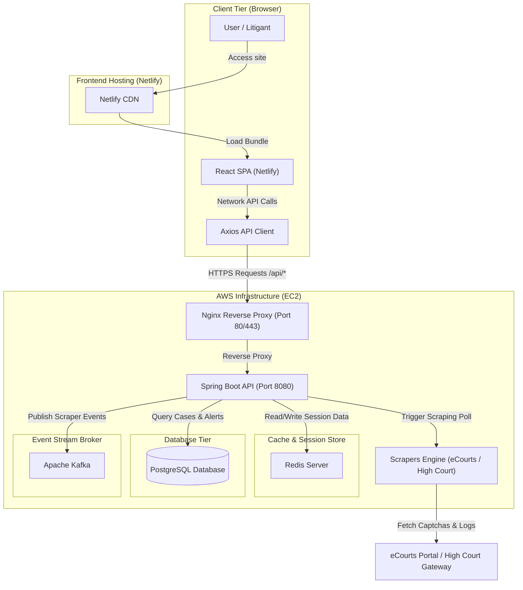

# CourTier — Production Deployment, Architecture & API Integration Guide

This guide details the system architecture, infrastructure deployment steps, environment configurations, and API integration mappings required to run **CourTier** in a production environment.

---

## 🗺 System Architecture

The following diagram illustrates the production architecture for CourTier. The React SPA is hosted serverless on Netlify, which connects directly via HTTPS CORS requests to a Spring Boot backend running on an AWS EC2 instance. The backend interfaces with PostgreSQL for relational storage, Redis for scraper session state and captcha caching, Kafka for async scraping queues, and external eCourts portal gateways.



---

## 🌐 Frontend Deployment (Netlify)

### 1. Build and Publish Settings
Configure the following deployment settings in the Netlify Dashboard:
*   **Repository**: `CourTier`
*   **Base directory**: `frontend` *(when migrated to the monorepo, or leave empty if deploying standalone)*
*   **Build command**: `npm run build`
*   **Publish directory**: `dist` *(if standalone)* or `frontend/dist` *(if deploying from monorepo root)*
*   **Build image**: `Ubuntu Focal` (or latest available)

### 2. Security Headers & Single Page App Routing
Vite produces a Single Page Application (SPA). To prevent HTTP 404 errors on browser refresh and secure the assets, the repository includes a `netlify.toml` file at the root. It configures:
1.  **Security Headers**: Adds headers like Content Security Policy (CSP), Strict Transport Security (HSTS), X-Frame-Options, and X-Content-Type-Options.
2.  **SPA Rewrites**: Redirects all non-file client routes (`/*`) to `/index.html` with a `200` status code, enabling client-side React Router to resolve pages correctly.

---

## 🖥 Backend Deployment (AWS EC2)

### 1. EC2 Instance Requirements
*   **Recommended Instance**: `t3.medium` (2 vCPUs, 4GB RAM) or larger.
*   **Operating System**: Ubuntu Server 22.04 LTS
*   **Storage**: 30GB General Purpose SSD (gp3)

### 2. AWS Security Group Configuration
Open the following inbound ports in your AWS Security Group:
*   `80 (TCP)`: HTTP for Nginx (redirected to HTTPS)
*   `443 (TCP)`: HTTPS for Nginx SSL traffic
*   `22 (TCP)`: SSH access for administrators
*   *Note: Port `8080` (Spring Boot), `5432` (Postgres), `6379` (Redis), and `9092` (Kafka) should remain closed to the public internet.*

### 3. Nginx Reverse Proxy & SSL Setup
1.  Install Nginx and Certbot:
    ```bash
    sudo apt update
    sudo apt install nginx certbot python3-certbot-nginx -y
    ```
2.  Create an Nginx configuration file at `/etc/nginx/sites-available/courtier`:
    ```nginx
    server {
        listen 80;
        server_name api.courtier.in;

        # Redirect all HTTP requests to HTTPS
        return 301 https://$host$request_uri;
    }

    server {
        listen 443 ssl http2;
        server_name api.courtier.in;

        ssl_protocols TLSv1.2 TLSv1.3;
        ssl_prefer_server_ciphers on;
        ssl_ciphers EECDH+AESGCM:EDH+AESGCM;

        location / {
            proxy_pass http://localhost:8080;
            proxy_set_header Host $host;
            proxy_set_header X-Real-IP $remote_addr;
            proxy_set_header X-Forwarded-For $proxy_add_x_forwarded_for;
            proxy_set_header X-Forwarded-Proto $scheme;

            # CORS Configuration for Netlify Frontend
            add_header 'Access-Control-Allow-Origin' 'https://courtier.netlify.app' always;
            add_header 'Access-Control-Allow-Methods' 'GET, POST, PUT, DELETE, OPTIONS' always;
            add_header 'Access-Control-Allow-Headers' 'Authorization, Content-Type, Accept, Origin' always;
            add_header 'Access-Control-Expose-Headers' 'Content-Length,Content-Range' always;

            if ($request_method = 'OPTIONS') {
                add_header 'Access-Control-Allow-Origin' 'https://courtier.netlify.app' always;
                add_header 'Access-Control-Allow-Headers' 'Authorization, Content-Type, Accept, Origin' always;
                add_header 'Access-Control-Max-Age' 1728000;
                add_header 'Content-Type' 'text/plain charset=UTF-8';
                add_header 'Content-Length' 0;
                return 204;
            }
        }
    }
    ```
3.  Enable the configuration and reload Nginx:
    ```bash
    sudo ln -s /etc/nginx/sites-available/courtier /etc/nginx/sites-enabled/
    sudo nginx -t && sudo systemctl reload nginx
    ```
4.  Acquire Let's Encrypt SSL certificates:
    ```bash
    sudo certbot --nginx -d api.courtier.in
    ```

### 4. Systemd Daemon Service Configuration
Create a systemd service file `/etc/systemd/system/courtier.service` to daemonize the Spring Boot application:
```ini
[Unit]
Description=CourTier Backend Spring Boot API Service
After=syslog.target network.target postgresql.service redis.service kafka.service

[Service]
User=ubuntu
WorkingDirectory=/home/ubuntu
EnvironmentFile=/home/ubuntu/.env
ExecStart=/usr/bin/java -jar /home/ubuntu/courtier-backend.jar
SuccessExitStatus=143
Restart=on-failure
RestartSec=10
LimitNOFILE=65536

[Install]
WantedBy=multi-user.target
```
Enable and start the service:
```bash
sudo systemctl daemon-reload
sudo systemctl enable courtier.service
sudo systemctl start courtier.service
```

---

## 🗄 Database & Cache Configurations

### 1. PostgreSQL Relational Schema
The PostgreSQL database serves as the system of record.
*   **Default Port**: `5432`
*   **Database Name**: `courtier`
*   **Recommended Database Tables**:
    *   `users`: Tracks authenticating users (lawyers, litigants).
    *   `cases`: Stores structural case properties (CNR, court name, judge, status).
    *   `case_hearings`: Tracks historic and future hearing dates (hearing date, purpose, judge).
    *   `case_acts`: Stores acts/sections associated with a case.
    *   `user_cases`: Map table connecting users to the cases they track.
    *   `notifications`: Stores scraper activity, updates, and hearing alarms.

### 2. Redis Caching & Session Layer
Redis serves as a fast-evicting cache for base64 CAPTCHA images and eCourts scraping sessions.
*   **Default Port**: `6379`
*   **Eviction Policy**: Set to `allkeys-lru` in `/etc/redis/redis.conf` to guarantee session timeouts and conserve RAM.
*   **Configuration Keys**:
    *   `captcha:{sessionId}`: Holds eCourts temporary captcha solution values.
    *   `session:{cnrNumber}`: Stores temporary active session state for ecourts portal navigation.

### 3. Apache Kafka Event Stream
Kafka queues scraping updates asynchronously to prevent browser API requests from timing out during slow scraping lookups.
*   **Default Port**: `9092`
*   **Required Topics**:
    *   `case-polling-updates`: Triggered when a case starts updating. Scraper consumers poll this queue, fetch HTML from ecourts, parse it, and publish the results.
    *   `notification-events`: Triggered when a case's next hearing date changes. Notification consumers process this queue and trigger in-app, email, or SMS alerts.

---

## 🔌 API Integration Mappings

The frontend Axios client connects to the following backend REST endpoints exposed by the Spring Boot server:

| HTTP Method | API Path | Description | Request Body / Query Params | Response Type | Auth Required |
| :--- | :--- | :--- | :--- | :--- | :--- |
| **POST** | `/api/auth/register` | Register a new user account | `RegisterRequest` (body) | `ApiResponse<string>` | No |
| **POST** | `/api/auth/verify-email` | Verify email OTP and get tokens | `VerifyOtpRequest` (body) | `ApiResponse<AuthResponse>` | No |
| **POST** | `/api/auth/login` | Login user, issues JWTs | `LoginRequest` (body) | `ApiResponse<AuthResponse>` | No |
| **POST** | `/api/auth/forgot-password` | Send password reset email OTP | `email` (query param) | `ApiResponse<string>` | No |
| **POST** | `/api/auth/reset-password` | Reset password using email OTP | `ResetPasswordRequest` (body) | `ApiResponse<string>` | No |
| **POST** | `/api/auth/refresh` | Refresh JWT using refresh token | `refreshToken` (body) | `ApiResponse<AuthResponse>` | No |
| **POST** | `/api/auth/refresh-token` | Fallback refresh endpoint | `refreshToken` (body) | `ApiResponse<AuthResponse>` | No |
| **GET** | `/api/cases` | Fetch all cases tracked by current user | None | `ApiResponse<CaseResponse[]>` | Yes (Bearer) |
| **POST** | `/api/cases` | Start tracking a new case | `AddCaseRequest` (body) | `ApiResponse<CaseResponse>` | Yes (Bearer) |
| **GET** | `/api/cases/{cnr}` | Fetch details of a single case | None | `ApiResponse<CaseResponse>` | Yes (Bearer) |
| **DELETE** | `/api/cases/{cnr}` | Stop tracking a case | None | `ApiResponse<void>` | Yes (Bearer) |
| **POST** | `/api/cases/{cnr}/poll` | Trigger a manual eCourts sync | None | `ApiResponse<CaseResponse>` | Yes (Bearer) |
| **GET** | `/api/cases/captcha` | Fetch new eCourts CAPTCHA code | `cnrNumber` (query param) | `ApiResponse<CaptchaResponse>` | Yes (Bearer) |
| **GET** | `/api/notifications` | Fetch scraper alerts and hearing logs | None | `ApiResponse<CourtNotification[]>` | Yes (Bearer) |

---

## 🔑 Frontend Environment Variables Reference

Vite injects configuration variables at build time using static replacement. The following variables are supported:

### 1. `VITE_API_URL`
*   **Purpose**: The base URL of the backend Spring Boot REST API service.
*   **Default (Local)**: `http://localhost:8080` (requests proxy via Vite dev server `/api` proxy mapping to avoid local CORS).
*   **Production**: `https://api.courtier.in` (points directly to the EC2 backend Nginx gateway).
*   **Axios Integration**: Prepend to `baseURL` inside `src/api/index.ts` to coordinate direct CORS networking.
*   **Example Configuration**:
    ```env
    VITE_API_URL=https://api.courtier.in
    ```

### 2. `NODE_ENV`
*   **Purpose**: Designates compilation target optimization states.
*   **Values**: `development` | `production` | `test`
*   **Usage**: Controlled automatically by Vite. Set to `production` when running `npm run build`.

---

## 🔒 Secret & Security Audit Checklist

To guarantee production safety, the following validation checks were completed:
1.  **No Hardcoded Secrets**: Scanned source files to ensure no database passwords, JWT secrets, TLS private keys, or third-party service tokens are checked in.
2.  **Environment Variables**: All backend credentials must be loaded from `/home/ubuntu/.env` on the EC2 server and never exposed to the client.
3.  **Cross-Origin Isolation**: Nginx on the backend EC2 server is restricted to accept traffic only from the trusted Netlify frontend domain (`https://courtier.netlify.app`), shielding internal APIs from unauthorized external origins.
4.  **JWT Safe Storage**: Access tokens are kept in transient memory or browser local storage, and all API calls apply them dynamically via Axios headers, preventing leakages.
